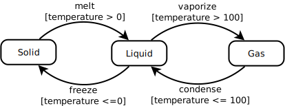

# ea-state-machine
[](https://www.npmjs.org/package/ea-state-machine)
[](https://travis-ci.org/eascientific/ea-state-machine)

A library for general purpose finite state machines with support for navigation and routing.

TODO: Make pic smaller and centered



## Overview

This `state machine` library can be used to track the states and model state transitions of 
  - business objects,
  - application status,
  - proccess flows,
  - and many more.

Using finite state machine models helps to structure and reason about problems. It supports creating maintainable business rules and source code.
Use the state machine diagrams to communicate behaviour and requirements.

Examples:
  - *Task Management*: Once a task is `pending`, it can be `assigned`, `completed`, or `canceled`. An email is send out to the assinged person.
  - *Flight status*: A plane is `IN` the gate and then is pushed `OUT`. Once `ON` the runway, the plane takes `OFF` from the origin airport to land `ON` at the destination.

## Design and Features
TODO: focus on up side and move this to documentation, create a doc folder, 
one doc page (does anchor linking work?)
 - Design
 - States
 - Transitions
 - Guards
 - API? (how to link to doc generated)
 - List examples
One page per example

Most `routing` libraries in frontend frameworks have notions of state machines, but are often incomplete or are using a wrong abstraction. E. g.: A `route` is not a real route from `A` to `B`, but rather a `page`, which is better modeled as a `state`. Once you realize that, you can model "real" routes as a transition from one state to the other, which allows you to execute business logic when a user navigates from one page to another. Guards on transitions allow to control the flow of a user with a centralzed set of business rules.
The reason that curent routing libraries are not fully supporting a state machine model is that users are often allowed to navigate from any page to any page and setting up all those transitions is too tedious. So guards are not on the transition, but more an entry condition to a page.
This library overcomes this shortcomming of state machine with the addition of a `Transition Defintion`. This allows for the simple common case scenario as well as enableing to extent your page navigation with complex flow rules.
Just using the abstation of this library allows to move this logic from an older framework toa new one. Write your routing logic once, run it everywhere!
 
## Usage

Using npm:
```shell
  npm install --save-dev javascript-state-machine
```
```js
import { FSM } from 'ea-state-machine'

// defining set of possible states
const state = {
  solid: { name: 'Ice'},
  liquid: { name: 'Water'},
  gas: { name: 'Vapor'}
}
// guards prevent transitions by returning false
const guard = {
  canMelt: (fsm, from, to) => fsm.data.temperature > 0,
  canVaporize: (fsm, from, to) => fsm.data.temperature > 100,
  canCondense: (fsm, from, to) => fsm.data.temperature < 100,
  canFreeze: (fsm, from, to) => fsm.data.temperature >= 0
}
// transition definitions can be FROM one or multiple states TO one or many
const transitionDefiniton = {
    melt: {
      from: () => [state.solid],
      to: () => [state.liquid],
      guards: [guard.canMelt],
      action: () => console.log('melting ...'),
    },
    vaporize: {
      from: () => [state.liquid],
      to: () => [state.gas],
      action: () => console.log('vaporizing ...'),
      guards: [guard.canVaporize],
    },
    condense: {
      from: () => [state.gas],
      to: () => [state.liquid],
      guards: [guard.canCondense],
      action: () => console.log('condenseing ...'),
    },
    freeze: {
      from: () => [state.liquid],
      to: () => [state.solid],
      guards: [guard.canFreeze],
      action: () => console.log('freezing ...'),
    },
  }
// data associated with the fsm
const environment = { temperature: 0 }
const fsm = new FSM(
  state, // all states
  transitionDefiniton, // transition defiitions between states
  state.solid, // optional: start state, if omitted, a transition to the first state needs to happen
  environment // associated data with the state machine
)
```
... getting the current state

`fsm.currentState` // ice: Object `state.solid`

... can we melt?

`fsm.canTranstionTo(fsm.statesliquid)` // `false`

... heating the environment
```js
fsm.changeData({ environment.temperature = 4}) // heat and notify FSM 
const isPossible = fsm.canTranstionTo(fsm.statesliquid) // true
fsm.transitionByDefinition(transitionDefiniton.melt)
fsm.currentState // state.liquid (water)
```

